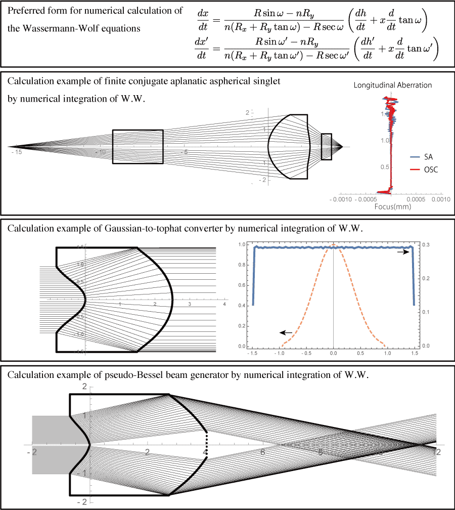
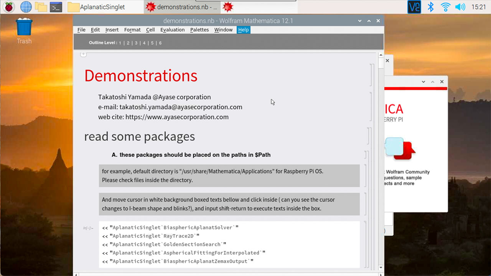
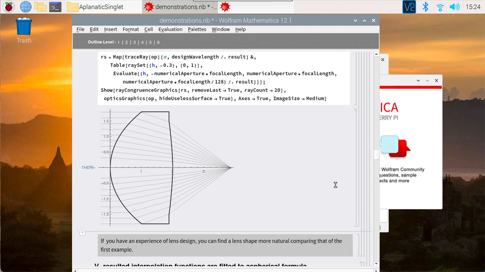
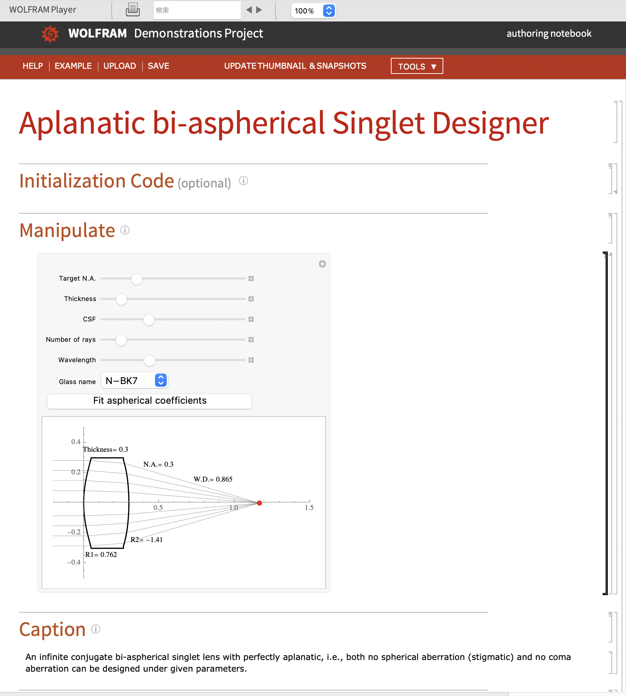

# Aspherical singlet design following Wassermann-Wolf equations




## Aims of this repository

<u>***1.Aspherical lens design for everyone***</u>

You can design an aspherical singlet (single lens) only giving few paraxial parameters and highest N.A.. If your parameters are consistent, you can get your lens shape by typing few commands (evaluation of some function written in Mathematica language) and show cross-section of the lens and traced rays.

A demonstration file named "demonstrations.nb" shows the design procedure for an [aplanatic](https://en.wikipedia.org/wiki/Aplanatic_lens) (free of both [spherical](https://en.wikipedia.org/wiki/Spherical_aberration) and [coma aberrations](https://en.wikipedia.org/wiki/Coma_aberration)) aspherical singlet step by step.

<u>***2. Demonstration of numerical integration of Wassermann-Wolf equation***</u>

Classic Wassermann-Wolf equation[^1] is a set of simultaneous first-order nonlinear ordinary differential equations and expresses what shape the two aspheres of the singlet should have when an incoming and outgoing ray congruence (a bundle of consistent rays) are determined.
A file named "Wasserman-WolfAndFurther.nb" shows derivation of Wassermann-Wolf equation from Snell's law and formulae of numerical integration of the equation for specific paraxial conditions.

Packages in this repository have a solver of the equation using numerical integration, a ray tracer in meridional plane (i.e., two-dimensional) and other utilities. All packages and demonstration codes are written in Mathematica (Wolfram language) and these can be executed of course by Mathematica app. in Windows, macOS or linux also by Mathematica bundled in [Raspberry pi OS](https://www.raspberrypi.org/software/) (former, called Raspbian). Raspberry Pi 3B+ or 4B can execute the codes without user patience.

If you are not familiar to Mathematica, it is better to visit its [tutorial](https://www.wolfram.com/language/fast-introduction-for-math-students/) first.

<u>***3. Arousing other applications using Wassermann-Wolf equation***</u>

The classic equation is not limited for aplanatic singlet. An afocal singlet, a gaussian-to-tophat converter and pseudo-Bessel beam generator are taken up in the "Wasserman-WolfAndFurther.nb" as examples. These examples do not satisfy aplanatism, but can be handled and determined by Wassermann-Wolf equation. There may be many other applications of the equation.

To solve the equation, Mathematica may not be necessarily required. Other symbol manipulation systems such as Maple, SymPy+SciPy can also handle the equation and perform its numerical integration. Furthermore, once a specific application is formulated, numerical computations can be written in a compiler language, which will increase execution efficiency.

[^1]: G.D.Wasermann,E.Wolf, "On the Theory of Aplanatic Aspheric Systems" Proc.Phys.Soc.B62,2 (1949)

## Descriptions of files

There are three example files in the repository.
#### demonstrations.nb

demonstrations.nb is a Mathematica notebook file and demonstrates designing aspherical aplanatic singlets.

In the file, you can perform in turn,

1. import packages in AplanaticSinglet
2. assign paraxial parameters for an infinite conjugate lens
3. perform numerical integration to generate a solution of two aspherical surfaces as interpolation functions.
4. show a lens shape solved and result of traced rays.
5. show longitudinal aberrations, i.e., spherical aberration and OSC (Offense against the Sine Condition)
6. find maxmimum tolerance for decenter between surfaces.
7. fit the interpolation functions to aspherical formula.
8. output text that can be read in Zemax as .zmx file[^2].
9. and other conditions, singlet with cover glass, finite conjugate, etc...

[^2]: You should copy and paste the text to suitable text editor and save as .zmx file with UTF-16LE for character encoding and CR-LF for newline (EOL) because Mathematica has no UTF-16 encoder.
#### Wassermann-WolfAndFurther.nb

Wassermann-WolfAndFurther.nb shows deriving Wassermann-Wolf equations from Snell's law. In the file,

1. Wassermann-Wolf equations from Snell's law are derived
3. explicit equations for infinite conjugate singlet are derived
4. explicit equations for infinite conjugate singlet with a cover glass are derived
5. explicit equations for finite conjugate singlet without cover glasses are derived
6. explicit equations for finite conjugate singlet with cover glass in the image space are derived
7. explicit equations for finite conjugate singlet with cover glass in the object space are derived
8. explicit equations for finite conjugate singlet with cover glass in both spaces are derived
9. explicit equations for afocal singlet are derived
10. explicit equations for one-dimensional gaussian-to-tophat converter are derived
11. explicit equations for pseudo-Bessel beam generator are derived.

All explicit equations can lead thier numerical solutions on the notebook when requisite parameter values are given for each of the cases.


### Provided packages

The files above need some Mathematica packages that are provided in a directory named 'AplanaticSinglet' and should be installed somewhere on the Mathematica search path, $Path. The directory and files inside it should be moved on the path.
Descriptions for packages are in a file 'PACKAGES.md'

#### How to install the packages

for Raspberry Pi OS, run this script on the top level of this directory.

```
% sudo ./installPackages
```

for other OS, linux, macOS or Windows,
move the AplanaticSinglet folder at anywhere on $Path, for example, on macOS,

> ~/Library/Mathematica/Applications/

with suitable file permissions.


## Execution example on Raspberry Pi

A movie that shows demonstration of execution 'demonstration.nb' file on Mathematica bundled with Raspberry Pi OS will soon be uploaded.





You can see the solver surely can work well on a Raspberry Pi.

## Demonstration movie

An example movie is now shown on [YouTube](https://youtu.be/IIygI683LsU).
The demonstration file is executed on Raspberry Pi 4B+.

## AplanaticSingletDesigner.nb

AplanaticSingletDesigner.nb file can work as demonstration notebook for "Wolfram Player", not Mathematica and shows infinite aspherical singlet lens shape for given parameters. The parameters are target N.A., lens thickness, CSF  (Coddington Shape Factor, the lens bending parameter), material of lens and wavelengrh.Its focal length is always fixed to 1.0.

The graphics in its manipulate pane includes lens shape and traced rays. The number of rays is also included in the changeable parameters. When you change prameter values the graphics responds immediately.



The pane has "Fit aspherical coefficients" button that popups a small window showing fitted coefficients of aspherical formula for both surfaces.

This demonstration notebook may not be executed on Raspberry Pi because it needs calculation performance. But "Wolfram Player" is free on several desktops such as macOS, Windows or Linux even on iOS.

Let's try and have fun.

## contact infomation

Takatoshi Yamada, Ayase Co.,Ltd.


e-mail: takatoshi.yamada@ayasecorporation.com

web cite: https://www.ayasecorporation.com


### additional infomation
change visibility public at Jun7, 2021.